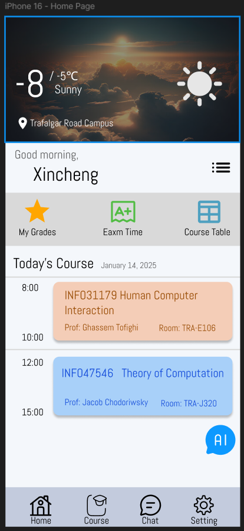

# HCL-A2

## About

This prototype application allows users to view course content, submit assignments, and communicate with classmates. At the same time, it meets the needs of users of all ages. It should also provide AI tools to better help users organize and solve their problems.

## Prototypes

  
  
  
  
  
  
  
  
  
  

## Top Five New desirable Functionalities

Each page of the app has AI tools to help users personalize their settings

Real-time notifications, the app will send users overdue homework alerts and notifications of overdue homework

The app can automatically switch day/night mode based on the phone's appearance mode

Support voice input/speech to text and other functions in the chat function

Provide user feedback function, users can provide any ideas or suggestions to the application developer in the feedback.

## Links

- [Link to Figma Design](https://www.figma.com/design/YylTFNOPAKUYPofuyQIlQP/Assignment2?node-id=0-1&t=7ek6tnBW9kedvtFp-1)
- [Link to Github Repository](https://github.com/TonyWu2036/HCL-A2)
- [Link to Youtube Demo](https://youtu.be/l3eZowsOFI4)
